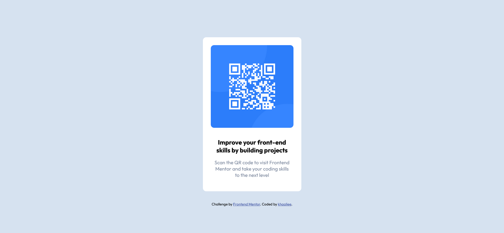

# Frontend Mentor - QR code component solution

This is a solution to the [QR code component challenge on Frontend Mentor](https://www.frontendmentor.io/challenges/qr-code-component-iux_sIO_H). Frontend Mentor challenges help you improve your coding skills by building realistic projects. 

## Table of contents

  - [Screenshot](#screenshot)
  - [Links](#links)
  - [Built with](#built-with)
  - [Useful resources](#useful-resources)
  - [Author](#author)

### Screenshot

### Links

- Solution URL: [Frontend Mentor Solution](https://www.frontendmentor.io/solutions/qr-code-component-xktXYQf1Wy)
- Live Site URL: [QR Code Component - Challenge by Frontend Mentor](https://khaaliee.github.io/qr-code-component/)

### Built with

- Semantic HTML5 markup
- CSS custom properties
- Flexbox
- Mobile-first workflow

### Useful resources

- [CSS Responsive Design by MDN](https://developer.mozilla.org/en-US/docs/Learn/CSS/CSS_layout/Responsive_Design)

## Author

- Frontend Mentor - [@khaaliee](https://www.frontendmentor.io/profile/khaaliee)

